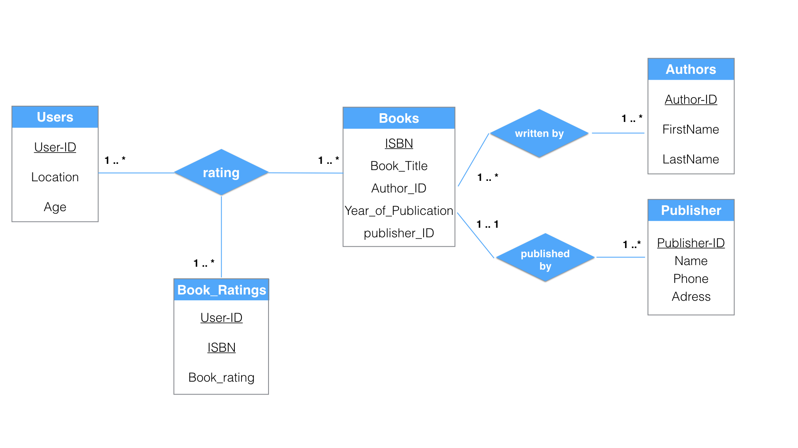

# Book Rating Database

A database project for CSC 4402 class Spring 2017 at Louisiana State University.

### Book crossing dataset
book crossing dataset is collected by Cai-Nicolas Ziegler in a 4-week crawl from [bookcrossing.com](https://www.bookcrossing.com/). It contains 1,149,780 ratings of 271,379 books by 278,858 users.

You can get the original datasets from [here](http://www2.informatik.uni-freiburg.de/~cziegler/BX/).
The modified datasets we used are in *data* directory.

### E-R Model of book rating database

Here is the E-R model:



### Tables

It needs five tables in the book rating database:

```sql

#Table books
create table books
(
ISBN varchar(13),
Book_Title varchar(255),
Author_ID int(11),
Year_Of_Publication int(10),
Publisher_ID int(11),
primary key (ISBN)
);

#Table users
create table users
(
User_ID int(11),
Location varchar(255),
Age int(11),
primary key (User_ID)
);

#Table Book_Ratings
create table book_ratings
(
User_ID int(11),
ISBN varchar(13),
Rating int(11),
primary key (User_ID, ISBN)
);

#Table Authors
create table authors
(
Author_ID int(11),
Name varchar(255),
Phone int(10),
Gender varchar(1),
Address varchar(255),
primary key (Author_ID)
);

#Table Publishers
create table publishers
(
Publisher_ID int(11),
Name varchar(255),
Phone int(10),
Address varchar(255),
primary key (Publisher_ID)
);
```
## License

This project is licensed under the GNU License - see the [LICENSE](LICENSE) file for details.
